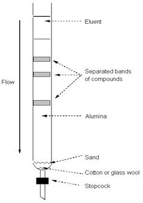

## Theory 

### Chromatography:
 

Chromatography has been developed into a new method of separation of mixture of substances mainly when they are available in small amounts. This method is very useful when the components of a mixture have almost the same physical and chemical properties and hence can’t be separated by other usual methods of separations. The term chromatography means writing in colour (in Greek: Khromatos-colour, and graphos- written). It was discovered by Mikhail Tswett in 1906. 

 

The methods of separation in chromatography are based on the distribution of the components in a mixture between a fixed (stationary) and a moving (mobile) phase. The stationary phase may be a column of adsorbent, a paper, a thin layer of adsorbent on a glass plate, etc., through which the mobile phase moves on. The mobile phase may be a liquid or a gas. When a solid stationary phase is taken as a column it is known as column chromatography.

### Column Chromatography:

  

 

 

Column chromatography is one of the most useful methods for the separation and purification of both solids and liquids. This is a solid - liquid technique in which the stationary phase is a solid & mobile phase is a liquid. The principle of column chromatography is based on differential adsorption of substance by the adsorbent.

 

The usual adsorbents employed in column chromatography are silica, alumina, calcium carbonate, calcium phosphate, magnesia, starch, etc., selection of solvent is based on the nature of both the solvent and the adsorbent. The rate at which the components of a mixture are separated depends on the activity of the adsorbent and polarity of the solvent. If the activity of the adsorbent is very high and polarity of the solvent is very low, then the separation is very slow but gives a good separation. On the other hand, if the activity of adsorbent is low and polarity of the solvent is high the separation is rapid but gives only a poor separation, i.e., the components separated are not 100% pure.

 

The adsorbent is made into slurry with a suitable liquid and placed in a cylindrical tube that is plugged at the bottom by a piece of glass wool or porous disc. The mixture to be separated is dissolved in a suitable solvent and introduced at the top of the column and is allowed to pass through the column. As the mixture moves down through the column, the components are adsorbed at different regions depending on their ability for adsorption. The component with greater adsorption power will be adsorbed at the top and the other will be adsorbed at the bottom. The different components can be desorbed and collected separately by adding more solvent at the top and this process is known as elution. That is, the process of dissolving out of the components from the adsorbent is called elution and the solvent is called is called eluent. The weakly adsorbed component will be eluted more rapidly than the other. The different fractions are collected separately. Distillation or evaporation of the solvent from the different fractions gives the pure components.

 

Intermolecular forces, which vary in strength according to their type, make organic molecules to bind to the stationary phase. The stronger the intermolecular force, the stronger the binding to the stationary phase, therefore the longer the compound takes to go through the column.

 

Intra-molecular hydrogen bonding is present in ortho- nitro phenol. This is due to the polar nature of the O-H bonds which can result in the formation of hydrogen bonds within the same molecule. But in para-nitro phenol, inter molecular hydrogen bonding (between H and O atoms of two different para-nitro phenol molecules) is possible. As result of inter molecular hydrogen bonding para-nitro phenol undergo association that increases the molecular weight, whereby decreasing volatility.

### Para nitro phenol with inter molecular hydrogen bonding:

  

### Ortho nitro phenol with inter molecular hydrogen bonding:

  

